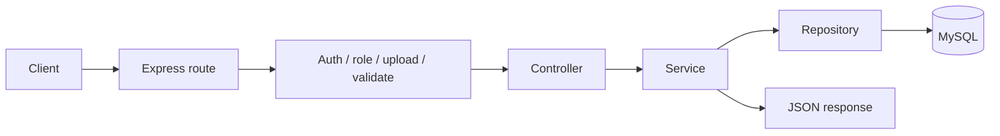

# API Overview

Main service expose REST API qua Express. Base path chung:

```text
/api/v1
```

Swagger UI duoc mount tai:

```text
/api-docs
```

Route prefixes duoc khai bao trong `packages/contracts/routes.ts` va register trong `apps/api/src/app.ts`.

## Route Modules

| Prefix | Route file | Module |
| --- | --- | --- |
| `/api/v1/auth` | `auth.route.ts` | Dang ky, dang nhap, refresh token, logout, session revoke, password reset. |
| `/api/v1/users` | `user.route.ts` | Public profile, current user, avatar, admin user management, user stats. |
| `/api/v1/problems` | `problem.route.ts` | CRUD problem, tags, problem listing/detail. |
| `/api/v1/problems/:problemId/testcases` | `testcase.route.ts` | Testcase listing, creation, and deletion. |
| `/api/v1/submissions` | `submission.route.ts` | Submit code, run code sandbox, list/detail submissions. |
| `/api/v1/matches` | `match.route.ts` | Match history, active match, match details, admin delete. |

## Common Request Flow



## Authentication Pattern

Protected routes dung middleware `requireAuth`:

```text
Authorization: Bearer <accessToken>
```

Admin routes dung them `requireAdmin`.

## Validation Pattern

Request validation dung `validateRequest(...)` voi Zod schemas trong `src/modules/*/*.schema.ts`.

Vi du:

- `auth.schema.ts`
- `user.schema.ts`
- `submission.schema.ts`
- `problem.schema.ts`
- `testcase.schema.ts`

## Response Shape

Phan lon endpoint tra ve JSON theo pattern:

```json
{
  "status": "Success",
  "message": "Human readable message",
  "data": {}
}
```

Loi validation/auth/business logic duoc chuyen ve global error handler `error.middleware.ts`.

## API Documentation Sources

De xem chi tiet endpoint, request body va response:

1. Chay main service.
2. Mo `/api-docs`.
3. Hoac doc route files trong `apps/api/src/modules/*/*.route.ts`.

Repo cung co `ocj_postman_collection.json` o root de import vao Postman.
