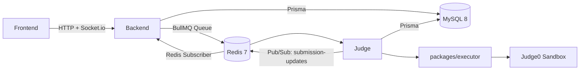

# System Architecture

Fessior is an Online Judge backend being developed toward four technical stories:
1. **Secure, versioned testcase ZIP ingestion.**
2. **Persistent, asynchronous, idempotent code judging.**
3. **Sandboxed untrusted-code execution via Judge0.**
4. **Realtime 1v1 matchmaking with member authorization and atomic conclusion.**

The sections below describe the current implementation. Phase 2 has versioned testcase sets, submission pinning, and participant-owned 1v1 matches. Phase 3 adds administrator ZIP ingestion and hidden-case read protection. Phase 4 adds ID-only BullMQ jobs, guarded submission transitions, retries, and bounded reconciliation. Phase 5 adds private Judge0 networking, explicit execution limits, and observed sandbox fixtures. Phase 6 adds Redis matchmaking, member authorization, match-bound submissions, atomic first-AC/ELO settlement, and reconnect recovery.

---

## 1. High-Level Architecture

The system consists of three applications and two shared packages:
- **Backend (`apps/backend`)**: Express 5 HTTP REST API, Socket.io gateway, BullMQ queue producer, and MySQL persistence via Prisma.
- **Judge (`apps/judge`)**: BullMQ background worker consuming judging jobs and invoking the Judge0 execution sandbox. Judge is the background worker responsible for consuming submission jobs and delegating code execution to Judge0.
- **Frontend (`apps/frontend`)**: React + Vite client for problem browsing, code editor, and 1v1 matchmaking UI.
- **`packages/contracts`**: Protocol contracts, DTO types, socket events (`SOCKET_EVENTS`), socket room helpers (`SOCKET_ROOMS`), Redis keys (`REDIS_KEYS`), and queue definitions (`QUEUE_NAMES`).
- **`packages/executor`**: Client adapter calling Judge0 REST API with language mapping and output normalization.
- **`infra`**: Separate local and production Docker Compose definitions for MySQL 8, Redis 7, Judge0 server/workers, and supporting data services.

The judge worker keeps process startup in `apps/judge/src/worker.ts`, environment and connections in `src/config/`, queue processing, persistence, and result publishing in `src/submissions/`, and Judge0 orchestration in `src/sandbox/`. `submissions/judging-context.repository.ts` reads the problem and its ordered testcases for a job; `packages/executor` owns the Judge0 HTTP client.



---

## 2. API Module Boundaries & Dependency Flow

Features in `apps/backend` are structured into self-contained vertical feature modules located in `apps/backend/src/modules/`:
- `auth`: Registration, login, refresh token rotation, and logout.
- `problems`: Problem CRUD, statements, CPU/memory limit configurations, and starter code.
- `testcases`: Testcase management with its own isolated transport (`testcase.route.ts`).
- `submissions`: Submission creation, BullMQ queuing, history queries, and temporary code execution preview.
- `matches`: 1v1 matchmaking queue, match coordination, ELO calculations, and match history.

Dependency direction strictly follows the single-direction rule:
$$\text{Transport (Route / Controller / Socket / Subscriber)} \longrightarrow \text{Service} \longrightarrow \text{Repository} \longrightarrow \text{Prisma / Database}$$

```text
apps/backend/src/
├── config/             # Typed env, Redis, Queue, and Prisma client
├── errors/             # AppError and domain error classes
├── middlewares/        # Express error handler, request validator
├── modules/
│   ├── auth/           # Route -> Controller -> Service -> Repository -> Prisma
│   ├── problems/       # Route -> Controller -> Service -> Repository -> Prisma
│   ├── testcases/      # Route -> Controller -> Service -> Repository -> Prisma
│   ├── submissions/    # Route -> Controller -> Service (Orchestration) -> Repository -> Prisma
│   └── matches/        # Route + Socket -> Service -> Repository -> Prisma
└── realtime/           # Thin adapters: socket.server.ts & submission-updates.subscriber.ts
```

- **Transport adapters** (`*.route.ts`, `*.controller.ts`, `*.socket.ts`, `*.subscriber.ts`): Parse incoming payloads, validate parameters via Zod schemas, authenticate requests, delegate to services, and format responses. **Zero direct Prisma calls.**
- **Services** (`*.service.ts`): Orchestrate business rules, validations, queue jobs, and domain logic. **Zero direct Prisma calls.**
- **Repositories** (`*.repository.ts`): Contain all Prisma queries, transactions, and persistence operations.
- **Realtime adapters** (`apps/backend/src/realtime/`):
  - `socket.server.ts`: Handles Socket.io authentication, connection lifecycle, and online user tracking in Redis.
  - `submission-updates.subscriber.ts`: Subscribes to Redis `submission-updates` and forwards events to `matchService`.

---

## 3. Database Ownership & Data Model

OCJ uses **MySQL 8** as the single source of truth for all application state. All queries are managed by Prisma (`apps/backend/prisma/schema.prisma`).

### Core Entities
- **`User`**: Account credentials, role (`USER` / `ADMIN`), and ELO rating.
- **`Problem`**: Problem statement, difficulty (`EASY`, `MEDIUM`, `HARD`), time/memory limits, and starter code.
- **`TestcaseSet`**: A numbered, problem-owned version with optional ZIP SHA-256 checksum. `Problem.active_testcase_set_id` selects one set; ZIP imports and individual edits create and activate a new set in a transaction.
- **`Testcase`**: Ordered input/output pair belonging to one set. Only cases with `is_example=true` are exposed to normal users.
- **`Submission`**: User code and verdict with a required `testcase_set_id` pinned at creation. The worker reads that set's cases even if the problem later activates a different set.
- **`Match` & `MatchParticipant`**: `Match` stores problem, match status, and winner ID. Exactly two participant rows are created for each 1v1 match; they own membership, participant status (`CODING`, `SUBMITTED_WA`, `ACCEPTED`), and rating changes. There are no `player1`/`player2` columns on `Match`.

---

## 4. Authentication & Authorization

Authentication is based on stateless JWT access tokens and persistent refresh tokens:
- **REST Endpoints**: Protected via `requireAuth` middleware (verifies Bearer token, checks user existence and active status). Admin endpoints require `requireAdmin` (`role === 'ADMIN'`).
- **Socket.io Connections**: Authenticated during handshake via `socket.handshake.auth.token` or `socket.handshake.query.token`. Unauthenticated connections are rejected before joining any rooms.
- **Configuration**: Managed by strictly typed environment variables (`JWT_ACCESS_SECRET`, `JWT_REFRESH_SECRET`) validated at boot time via Zod, requiring minimum 32 characters.
