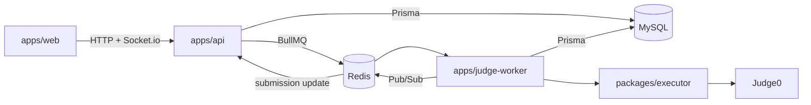

# Architecture

The repository has three runtime apps and two shared packages. `apps/api` owns HTTP routes, Prisma models, queue production, and Socket.io. `apps/judge-worker` consumes BullMQ submission jobs and calls Judge0 through `packages/executor`. `apps/web` is the demo client. `packages/contracts` defines the values and data types exchanged between apps.

API features are organized as modular vertical features under `apps/api/src/modules/`: `auth`, `users`, `problems`, `testcases`, `submissions`, and `matches`. Within each module, dependency direction flows strictly: route/controller/socket -> service -> repository -> Prisma. Express routes and Socket.io handlers are thin transport adapters; services own business logic and repositories own Prisma persistence. `apps/api/src/realtime` owns thin transport adapters: `socket.server.ts` for authentication, lifecycle, and handler registration, and `submission-updates.subscriber.ts` for delegating Redis Pub/Sub updates to `matchService`. Worker submission processing lives in `src/submissions`; Judge0 orchestration lives in `src/sandbox`. The Prisma schema and migration history remain in `apps/api/prisma`.

The current submission worker and matchmaking paths still have limitations recorded in [judging-pipeline.md](judging-pipeline.md), [realtime-matchmaking.md](realtime-matchmaking.md), and [AGENTS.md](../AGENTS.md). The directory move does not change their guarantees.

Local infrastructure is described by `infra/docker-compose.yml`. It includes MySQL, Redis, Judge0 server/workers and their backing PostgreSQL/Redis, plus the three apps in full Docker mode. The Judge0 environment example is `infra/judge0/judge0.env.example`.
