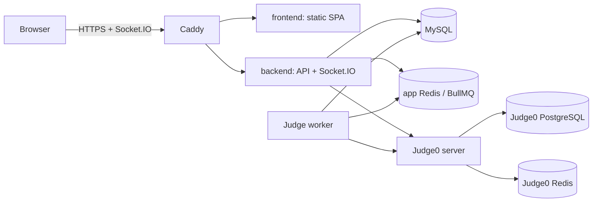

# Deployment

Fessior keeps local development and production deployment on separate Compose files. `npm run dev` and `infra/docker-compose.yml` remain the local workflow. Azure Ubuntu VPS production uses `infra/docker-compose.prod.yml` through `scripts/deploy.sh`.

## Production topology



Only Caddy publishes host ports `80` and `443`. MySQL, both Redis services, the backend, judge worker, Judge0 server/workers, and Judge0 data services have no host-published ports. The Judge0 network is internal to Docker. Caddy proxies `/api/*` and `/socket.io/*` to the backend and all other paths to the static frontend; its reverse proxy supports WebSocket upgrades directly.

Named volumes preserve MySQL, app Redis, Judge0 PostgreSQL/Redis, and Caddy certificate/configuration data.

## Prepare a fresh Azure Ubuntu VPS

1. Create an Ubuntu VPS with enough memory and disk for Docker, MySQL, and privileged Judge0 workers. Configure the Azure network security group to allow SSH from your IP and inbound TCP `80` and `443`.
2. Install Docker Engine and the Docker Compose plugin using Docker's Ubuntu instructions. Confirm `docker compose version` works for your deployment user.
3. Point the domain's DNS A record at the VPS public IPv4 address. Caddy needs public DNS and inbound ports 80/443 to issue and renew HTTPS certificates.
4. Clone the repository and check out the reviewed production branch. From the repository root, create `.env` from `.env.example`.
5. Set `DOMAIN` to the DNS name. Replace `MYSQL_ROOT_PASSWORD`, `MYSQL_PASSWORD`, `JWT_ACCESS_SECRET`, `JWT_REFRESH_SECRET`, `JUDGE0_POSTGRES_PASSWORD`, and `JUDGE0_REDIS_PASSWORD`. Each must be at least 32 characters using letters, numbers, `_` or `-`; use a different value for each. For example, generate values with `openssl rand -hex 32`. Do not reuse the example values. SMTP settings are optional unless password recovery email is needed.
6. Run `scripts/deploy.sh`. It validates configuration, creates an ignored mode-600 Judge0 config from `.env`, builds the production images, starts only the database/state services, runs the one-off migration, then updates the application stack and prints status. If migration fails, the script stops before updating application containers. It never runs `docker compose down` or prunes images.
7. Verify `https://<DOMAIN>` loads, sign in and use the problem list to check API routing, then submit code and confirm the verdict returns in the UI. The realtime submission/match UI exercises Socket.IO over the same HTTPS origin. Confirm in browser network tools that `/socket.io/` connects over WebSocket and that no Judge0 URL is exposed to the browser. A successful submission demonstrates the private backend → judge → Judge0 path.

Production secrets are read from the ignored root `.env`. `scripts/deploy.sh` generates `infra/judge0/judge0.prod.conf`, which is also ignored and mounted read-only into Judge0 containers. Back up `.env` and all named volumes securely.

The current baseline migration is designed for a clean database. Do not point this deployment at an existing database with data that must be retained; this repository does not yet provide a migration path for legacy production data.

## Operations

Run the deployment entrypoint again after pulling a reviewed commit:

```bash
git pull --ff-only
./scripts/deploy.sh
```

Inspect production status and logs with the same Compose project and file:

```bash
docker compose --env-file .env --project-name fessior-prod -f infra/docker-compose.prod.yml ps
docker compose --env-file .env --project-name fessior-prod -f infra/docker-compose.prod.yml logs -f backend judge caddy
```

The Compose project keeps infrastructure and application containers on named networks. Do not publish database, Redis, backend, judge, or Judge0 ports for remote debugging.
