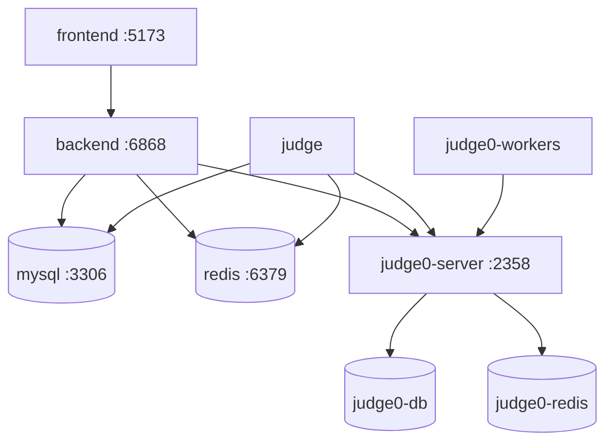

# Deployment & Infrastructure

This document describes container orchestration and deployment configurations for Fessior.

---

## 1. Container Topology (`infra/docker-compose.yml`)

The infrastructure setup is managed via Docker Compose:



| Service | Image / Build | Container Name | Host Port | Purpose |
| --- | --- | --- | --- | --- |
| `mysql` | `mysql:8.0` | `ocj_mysql` | `3307:3306` | Primary relational database |
| `redis` | `redis:7-alpine` | `ocj_redis` | `6379:6379` | BullMQ queuing, Pub/Sub, online tracking |
| `judge0-db` | `postgres:13.0` | `ocj_judge0_db` | internal | Backing store for Judge0 |
| `judge0-redis` | `redis:6.0` | `ocj_judge0_redis` | internal | Task queue for Judge0 workers |
| `judge0-server` | `judge0/judge0:1.13.0` | `ocj_judge0_server` | internal | Sandbox submission API |
| `judge0-workers`| `judge0/judge0:1.13.0` | `ocj_judge0_workers` | internal | Isolate-based execution workers |
| `judge0-local-proxy` | `node:22-alpine` | profile `hybrid` | `127.0.0.1:2358` | Local development access only |
| `backend` | `apps/backend/Dockerfile` | `ocj_backend` | `6868:6868` | HTTP API & Socket.io server |
| `judge` | `apps/judge/Dockerfile` | `ocj_judge` | internal | Submission queue processor; delegates execution to Judge0 |
| `frontend` | `apps/frontend/Dockerfile` | `ocj_frontend` | `5173:5173` | React frontend client |

---

## 2. Environment Configuration

The Backend HTTP Service, Judge Worker, MySQL, and app Redis use the root `.env` file. Judge0 server/workers and their own Postgres/Redis use only `infra/judge0/judge0.env.example`:
```yaml
env_file:
  - path: ../.env
```

The `app` and internal `judge0` networks are separate. Only Backend HTTP Service and Judge Worker join both. Judge0 containers have no application database URL, JWT secrets, or app Redis credentials. Full Docker Compose reaches Judge0 at `http://judge0-server:2358`; hybrid development enables the `hybrid` profile with a localhost-only TCP proxy. The root `.env` can therefore use `http://localhost:2358` for local processes.

---

## 3. Operations & Startup

### Start Full Stack
```bash
docker compose --env-file .env -f infra/docker-compose.yml up -d --build
```

### View Logs
```bash
docker compose --env-file .env -f infra/docker-compose.yml logs -f backend judge
```

### Stop Stack
```bash
docker compose --env-file .env -f infra/docker-compose.yml down
```

---

## 4. Production Considerations

1. **Database Migrations**: The API container runs `prisma migrate deploy` before starting. A dedicated release step can take over migration deployment later. The current Phase 2 baseline is only for a clean/reset database and does not migrate historical production data.
2. **Frontend Asset Delivery**: The dev Dockerfile runs Vite development mode. For production, compile static assets and serve via a reverse proxy (e.g., Nginx, Caddy, or CDN).
3. **Private Sandbox Network**: The default Compose configuration publishes no Judge0 port. Use the `hybrid` profile only for local development; it binds the proxy to `127.0.0.1`. The Judge0 network remains internal in both modes. Isolate runs inside privileged Judge0 worker containers, so this setup still depends on the host kernel, Docker, and Judge0 security; deploy on a dedicated trusted host for stronger separation.
4. **Data Persistence**: Persistent volumes (`mysql_data`, `redis_data`, `judge0_postgres_data`) must be backed up regularly.
