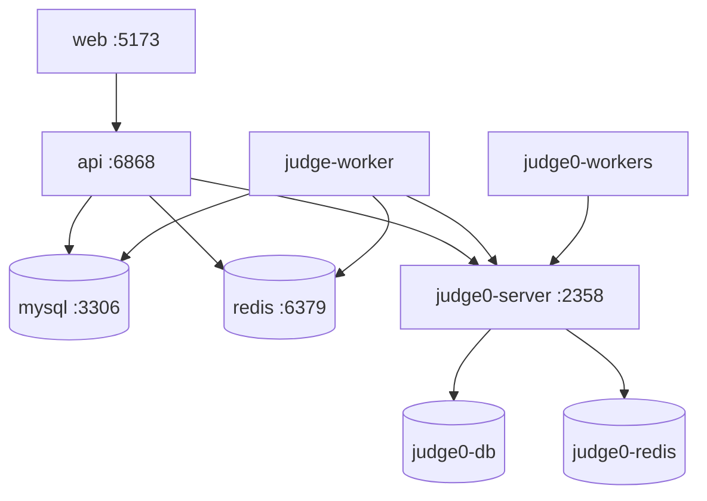

# Deployment & Infrastructure

This document describes container orchestration and deployment configurations for Fessior.

---

## 1. Container Topology (`infra/docker-compose.yml`)

The infrastructure setup is managed via Docker Compose:



| Service | Image / Build | Container Name | Host Port | Purpose |
| --- | --- | --- | --- | --- |
| `mysql` | `mysql:8.0` | `ocj_mysql` | `3307:3306` | Primary relational database |
| `redis` | `redis:7-alpine` | `ocj_redis` | `6379:6379` | BullMQ queuing, Pub/Sub, online tracking |
| `judge0-db` | `postgres:13.0` | `ocj_judge0_db` | internal | Backing store for Judge0 |
| `judge0-redis` | `redis:6.0` | `ocj_judge0_redis` | internal | Task queue for Judge0 workers |
| `judge0-server` | `judge0/judge0:1.13.0` | `ocj_judge0_server` | `2358:2358` | Sandbox submission API |
| `judge0-workers`| `judge0/judge0:1.13.0` | `ocj_judge0_workers` | internal | Isolate-based execution workers |
| `api` | `apps/api/Dockerfile` | `ocj_api` | `6868:6868` | HTTP API & Socket.io server |
| `judge-worker` | `apps/judge-worker/Dockerfile` | `ocj_judge_worker` | internal | Submission queue processor |
| `web` | `apps/web/Dockerfile` | `ocj_web` | `5173:5173` | React frontend client |

---

## 2. Environment Configuration

All services consume the root `.env` file directly:
```yaml
env_file:
  - path: ../.env
```

Within Docker Compose, internal container hostnames (`mysql`, `redis`, `judge0-server`) are passed explicitly via container `environment:` definitions, allowing the root `.env` to remain configured for host-machine local execution (`localhost:3307`, `localhost:6379`, `localhost:2358`) without conflicting.

---

## 3. Operations & Startup

### Start Full Stack
```bash
docker compose -f infra/docker-compose.yml up -d --build
```

### View Logs
```bash
docker compose -f infra/docker-compose.yml logs -f api judge-worker
```

### Stop Stack
```bash
docker compose -f infra/docker-compose.yml down
```

---

## 4. Production Considerations

1. **Database Migrations**: In production environments, replace `prisma db push` with `npx prisma migrate deploy` in a designated release step.
2. **Frontend Asset Delivery**: The dev Dockerfile runs Vite development mode. For production, compile static assets and serve via a reverse proxy (e.g., Nginx, Caddy, or CDN).
3. **Private Sandbox Network**: In production, remove public port mapping `2358:2358` on `judge0-server` and keep all Judge0 communication restricted to the internal Docker network.
4. **Data Persistence**: Persistent volumes (`mysql_data`, `redis_data`, `judge0_postgres_data`) must be backed up regularly.
