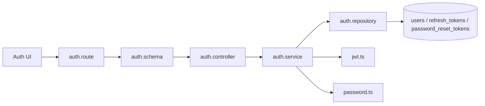
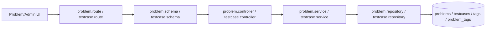
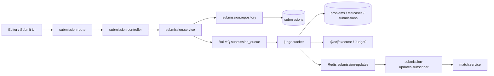
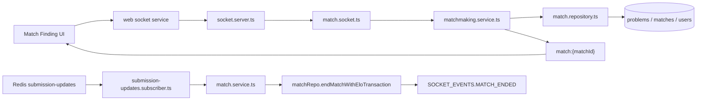

# Feature Flows

This file lists the main flows worth learning and explaining. The project is intentionally trimmed to a focused resume-friendly scope.

## 1. Authentication And Session

Users register/login, receive access + refresh tokens, and can revoke sessions.

Key files:

- `apps/api/src/modules/auth/auth.route.ts`
- `apps/api/src/modules/auth/auth.controller.ts`
- `apps/api/src/modules/auth/auth.service.ts`
- `apps/api/src/modules/auth/auth.repository.ts`
- `apps/api/src/modules/auth/auth.middleware.ts`
- `apps/api/src/modules/auth/jwt.ts`
- `apps/api/src/modules/auth/password.ts`

## 2. Problem And Testcase Management

Problems, tags, starter code, limits, and testcases are stored in MySQL through Prisma.

Key files:

- `apps/api/src/modules/problems/problem.route.ts`
- `apps/api/src/modules/problems/problem.controller.ts`
- `apps/api/src/modules/problems/problem.service.ts`
- `apps/api/src/modules/problems/problem.repository.ts`
- `apps/api/src/modules/problems/problem.schema.ts`
- `apps/api/src/modules/testcases/testcase.route.ts`
- `apps/api/src/modules/testcases/testcase.controller.ts`
- `apps/api/src/modules/testcases/testcase.service.ts`
- `apps/api/src/modules/testcases/testcase.repository.ts`
- `apps/api/src/modules/testcases/testcase.schema.ts`
- `apps/api/prisma/schema.prisma`

## 3. Submit Code And Judge

Main-service creates a MySQL submission, queues a BullMQ job, and judge-worker evaluates testcases asynchronously.

Key files:

- `apps/api/src/modules/submissions/submission.route.ts`
- `apps/api/src/modules/submissions/submission.controller.ts`
- `apps/api/src/modules/submissions/submission.service.ts`
- `apps/api/src/modules/submissions/submission.repository.ts`
- `apps/api/src/modules/submissions/execution-preview.service.ts`
- `apps/api/src/config/queue.ts`
- `apps/judge-worker/src/submissions/submission.worker.ts`
- `packages/executor/src/index.ts`

## 4. Realtime Matchmaking 1v1

Users join a Socket.io matchmaking queue. Main-service pairs close-ELO users, selects a MySQL problem, creates a match, and emits realtime match events.

Key files:

- `apps/api/src/realtime/socket.server.ts`
- `apps/api/src/realtime/submission-updates.subscriber.ts`
- `apps/api/src/modules/matches/match.socket.ts`
- `apps/api/src/modules/matches/matchmaking.service.ts`
- `apps/api/src/modules/matches/match.route.ts`
- `apps/api/src/modules/matches/match.service.ts`
- `apps/api/src/modules/matches/match.repository.ts`
- `apps/api/src/modules/matches/elo.ts`

## Removed From Current Learning Scope

The previous contest, social/friendship, shop, notification, report/moderation, AI roadmap/debug, news, and mock interview flows are no longer part of the active product surface.
