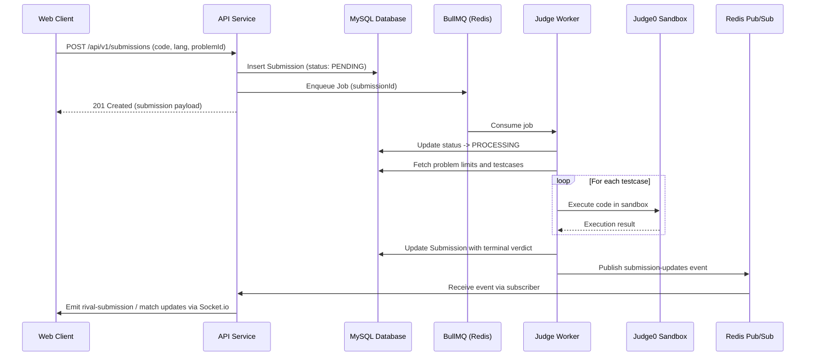

# Persistent, Asynchronous Code Judging

This document defines the target for **Story 2: Persistent, asynchronous, idempotent code judging**. The current API persists submissions and enqueues BullMQ jobs, but guarded terminal transitions, deterministic ID-only jobs, and reconciliation are planned work.

---

## 1. Flow Overview

Code submission evaluation is handled asynchronously using **BullMQ** on Redis, backed by durable **MySQL** records.



---

## 2. Submission State Machine

Target behavior: submissions transition strictly through guarded states:

$$\text{PENDING} \longrightarrow \text{PROCESSING} \longrightarrow \text{Terminal Verdict}$$

Terminal verdicts include:
- `ACCEPTED` (AC): All testcases passed within time and memory limits.
- `WA`: Wrong Answer on at least one testcase.
- `TLE`: Time Limit Exceeded.
- `MLE`: Memory Limit Exceeded.
- `RE`: Runtime Error.
- `CE`: Compilation Error.
- `SYSTEM_ERROR`: Sandbox failure or internal infrastructure exception.

Those guards and duplicate-delivery tests remain to be implemented.

---

## 3. Queue Contracts & Options

Queue interactions use constants defined in `@ocj/contracts`:
- Queue name: `QUEUE_NAMES.SUBMISSION` (`submission_queue`).
- Channel name: `REDIS_CHANNELS.SUBMISSION_UPDATES` (`submission-updates`).
- Job retry policy defined in `SUBMISSION_QUEUE_OPTIONS`:
  ```ts
  export const SUBMISSION_QUEUE_OPTIONS = {
    attempts: 3,
    backoff: {
      type: 'exponential',
      delay: 1000,
    },
    removeOnComplete: true,
    removeOnFail: false,
  };
  ```

---

## 4. Temporary Execution Preview (`runCode`)

For user-initiated ad-hoc test runs before official submission:
- `POST /api/v1/submissions/run`
- Handled by `ExecutionPreviewService` in `apps/api/src/modules/submissions/execution-preview.service.ts`.
- Executes against either the problem's public example testcases or user-provided `customInput`.
- Unsupported languages are rejected immediately with an HTTP 400 error rather than falling back to an arbitrary default.
