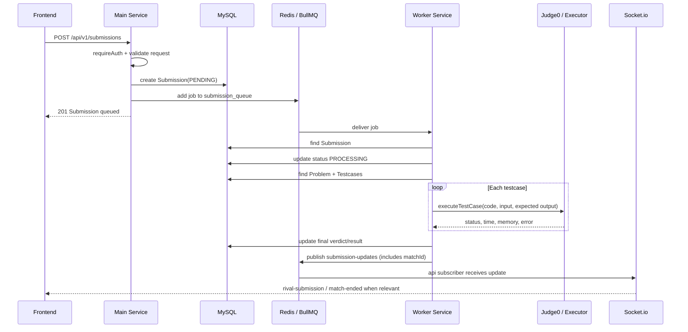

# Judging Pipeline

Submission flow duoc thiet ke bat dong bo: HTTP request chi tao submission va enqueue job; judge-worker xu ly cham bai rieng.

## Main Sequence



## Queue

Queue duoc khai bao trong `apps/api/src/config/queue.ts`:

```text
queue name: submission_queue
attempts: 3
backoff: exponential, delay 1000ms
removeOnComplete: true
removeOnFail: false
```

Worker lang nghe cung queue trong `apps/judge-worker/src/submissions/submission.worker.ts` voi concurrency:

```text
concurrency: 2
```

## Submission Create

Endpoint chinh:

```text
POST /api/v1/submissions
```

Route:

```text
apps/api/src/modules/submissions/submission.route.ts
```

Request:

- `problemId` (required)
- `language`: `cpp`, `java`, hoac `python` (required)
- `code` (required)
- `matchId` (optional) — link submission to a PvP match

Submission duoc tao trong MySQL voi status ban dau:

```text
PENDING
```

### Submission Model Fields

| Field | Type | Required | Indexed | Notes |
|-------|------|----------|---------|-------|
| `user_id` | string | yes | yes | FK to `users.id`. |
| `problem_id` | string | yes | yes | FK to `problems.id`. |
| `code` | string | ✅ | | |
| `language` | enum (cpp/java/python) | ✅ | | |
| `status` | enum | ✅ (default PENDING) | ✅ | See Verdicts |
| `match_id` | string (nullable) | | ✅ | Links to `matches.id`. |
| `execution_time` | number | | | |
| `memory_used` | number | | | |
| `error_message` | string | | | |
| `test_cases_passed` | number | | | Default 0. |
| `test_cases_total` | number | | | Default 0. |
| `ai_feedback` | string | | | Reserved optional field. |

## Worker Processing

Worker job data gom:

- `submissionId`
- `code`
- `language`
- `problemId`
- `matchId` (optional, read from Submission)

Xu ly:

1. Tim `Submission` theo `submissionId`.
2. Doi status sang `PROCESSING`.
3. Tim `Problem` theo `problemId`.
4. Tim tat ca `Testcase` theo `problemId`.
5. Map language sang Judge0 language id qua `getLanguageId`.
6. Chay tung testcase bang `executeTestCase`.
7. Dung o testcase fail dau tien.
8. Cap nhat final status, time, memory, passed/total.
9. Publish Redis channel `submission-updates` (kèm `matchId` nếu có).

## Verdicts

MySQL `Submission.status` co cac gia tri:

```text
PENDING
PROCESSING
ACCEPTED
WA
TLE
MLE
RE
CE
```

Trong worker:

- Khong tim thay problem -> `CE`, `Problem context not found`.
- Khong co testcase -> `CE`, `No testcases found for this problem`.
- Exception khi worker chay -> `RE`.

## Redis Pub/Sub Payload

Worker publish len channel `submission-updates`:

```json
{
  "submissionId": "...",
  "userId": "...",
  "problemId": "...",
  "status": "ACCEPTED",
  "testCasesPassed": 10,
  "testCasesTotal": 10,
  "matchId": "..."  (optional — only for PvP submissions)
}
```

Main-service subscribe channel nay trong `apps/api/src/realtime/submission-updates.subscriber.ts`, sau do goi `matchService.handleSubmissionUpdate`.

## Match Integration

Khi submission update lien quan den match dang `PENDING`:

1. Main-service nhan `matchId` tu pub/sub payload.
2. Neu co `matchId`, tim `Match` directly qua `prisma.match.findUnique({ id: matchId })`.
3. Neu KHONG co `matchId`, fallback tim `Match` theo `problem_id`, `userId`, status `PENDING`.
4. Hê thống emit `rival-submission` vao room `match:{matchId}`.
5. Neu status la `ACCEPTED`, goi `endMatch` cho tran 1v1.
6. `endMatch` update MySQL `matches`, user ELO/streak bang Prisma transaction.
7. Emit `match-ended` (kèm thông tin payload chi tiết: thay đổi ELO, role) để Frontend hiển thị Modal ngay lập tức.

## Known Limitations

- `match_id` is currently a logical reference instead of a Prisma relation. Match update code handles missing/inactive matches by returning early.

## Ad-Hoc Run

Endpoint:

```text
POST /api/v1/submissions/run
```

Muc dich: chay code nhanh, khong tao persistent submission theo route description.

### Luồng xử lý Testcase trong Ad-Hoc Run

- **Lấy Testcase mẫu**: Frontend khi gọi API lấy danh sách testcase mẫu sẽ truyền cờ `?example=true` để chỉ lấy các testcase public (`is_example: true`). Backend sẽ bỏ qua các testcase ẩn.
- **Chạy Testcase mẫu**: Backend (hàm `runCode`) tự động lọc `prisma.testcase.findMany({ is_example: true })` và chạy toàn bộ các testcase mẫu. Trả về `ACCEPTED` hoặc `WA` dựa trên so sánh output.
- **Chạy Tùy biến Input (Custom Input)**: Nếu request gửi kèm `customInput`, Backend sẽ không so sánh `expectedOutput`. Miễn là tiến trình không gặp lỗi (CE, RE, TLE), kết quả sẽ được đánh dấu là `ACCEPTED` (để Frontend có thể hiển thị `actualOutput` thay vì báo `WA`).

## Cơ chế Executor (Judge0 Docker Sandbox)

Giao tiếp với hệ thống sandbox thông qua `packages/executor`.

1. Gọi API Judge0 self-hosted để thực thi mã nguồn trong sandbox Docker.
2. `JUDGE0_URL` là bắt buộc về mặt runtime. Local hybrid dùng `http://localhost:2358`, Docker services dùng `http://judge0-server:2358`.
3. Nếu Judge0 không reachable hoặc trả lỗi sandbox/internal, executor sẽ throw để worker/BullMQ xử lý như infrastructure failure.
4. Hệ thống chỉ nhận verdict từ Judge0 Docker sandbox.
