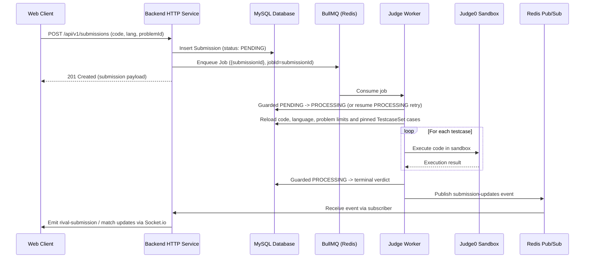

# Persistent, Asynchronous Code Judging

Phase 4 implements persistent, retry-safe judging. MySQL stores the authoritative Submission; BullMQ carries only its ID. Realtime publication is best effort after the terminal database write.

---

## 1. Flow Overview

Code submission evaluation is handled asynchronously using **BullMQ** on Redis, backed by durable **MySQL** records.



---

## 2. Submission State Machine

The repository uses conditional `updateMany` writes for transitions:

$$\text{PENDING} \longrightarrow \text{PROCESSING} \longrightarrow \text{Terminal Verdict}$$

Terminal verdicts include:
- `ACCEPTED` (AC): All testcases passed within time and memory limits.
- `WA`: Wrong Answer on at least one testcase.
- `TLE`: Time Limit Exceeded.
- `MLE`: Memory Limit Exceeded.
- `RE`: Runtime Error.
- `CE`: Compilation Error.
- `SYSTEM_ERROR`: Sandbox failure or internal infrastructure exception.

Submission creation pins `testcase_set_id` in MySQL. The Judge Worker reloads source code, language, problem limits, and ordered testcases from that pinned set. A terminal submission is a no-op on redelivery. `PENDING` is claimed with a guarded write. `PROCESSING` can be resumed on a BullMQ retry after a transient Judge0 or worker failure; BullMQ's single deterministic job identity coordinates normal delivery. Final verdict and `SYSTEM_ERROR` writes are guarded, so a stale delivery cannot overwrite a terminal state.

The Judge Worker persists the terminal result before publishing Redis Pub/Sub. A publication failure is logged and leaves the committed verdict intact; clients can recover through `GET /api/v1/submissions/:id`. Exhausted failed jobs are marked `SYSTEM_ERROR` with a safe message. Compile errors and wrong answers are terminal verdicts, not infrastructure exceptions to retry.

---

## 3. Queue Contracts & Options

Queue interactions use constants defined in `@ocj/contracts`:
- Queue name: `QUEUE_NAMES.SUBMISSION` (`submission_queue`).
- Channel name: `REDIS_CHANNELS.SUBMISSION_UPDATES` (`submission-updates`).
- Job retry policy defined in `SUBMISSION_QUEUE_OPTIONS`:
  ```ts
  export const SUBMISSION_QUEUE_OPTIONS = {
    attempts: 3,
    backoff: {
      type: 'exponential',
      delay: 1000,
    },
    removeOnComplete: true,
    removeOnFail: false,
  };
  ```

The Backend HTTP Service tries enqueue up to three times after inserting `PENDING`. If Redis is unavailable, it still returns the durable pending submission. Its interval reconciler scans at most 50 `PENDING` rows older than 60 seconds every 30 seconds, configurable with `SUBMISSION_RECONCILE_BATCH_SIZE`, `SUBMISSION_RECONCILE_STALE_MS`, and `SUBMISSION_RECONCILE_INTERVAL_MS`. It uses `jobId=submissionId`, checks existing BullMQ jobs, re-enqueues missing jobs, and marks a stale pending row `SYSTEM_ERROR` if its retained job already failed or completed without a verdict. This is a bounded recovery scan, not a transactional outbox. A Redis outage can delay judging until Redis returns; Pub/Sub events may be lost and clients must read MySQL-backed HTTP state.

---

## 4. Temporary Execution Preview (`runCode`)

For user-initiated ad-hoc test runs before official submission:
- `POST /api/v1/submissions/run`
- Handled by `ExecutionPreviewService` in `apps/api/src/modules/submissions/execution-preview.service.ts`.
- Executes against either the problem's public example testcases or user-provided `customInput`.
- Unsupported languages are rejected immediately with an HTTP 400 error rather than falling back to an arbitrary default.
