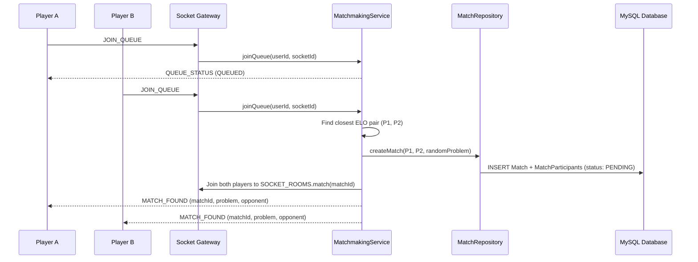

# Realtime 1v1 Matchmaking

This document describes the target for **Story 4: Realtime 1v1 matchmaking with member authorization and atomic conclusion**. Current matchmaking uses an in-memory queue; participant authorization and compare-and-set winner selection remain planned work.

---

## 1. Socket Architecture & Protocols

Realtime communication is powered by Socket.io in `apps/api/src/realtime/socket.server.ts`, with match event handlers registered via `apps/api/src/modules/matches/match.socket.ts`.

### Cross-Process Constants & Contracts
All event and room names are defined in `@ocj/contracts`:
- `SOCKET_EVENTS`: `CONNECT`, `DISCONNECT`, `JOIN_QUEUE`, `LEAVE_QUEUE`, `FORFEIT_MATCH`, `JOIN_MATCH`, `LEAVE_MATCH`, `QUEUE_STATUS`, `MATCH_FOUND`, `RIVAL_SUBMISSION`, `MATCH_ENDED`.
- `SOCKET_ROOMS.match(matchId)`: Formats room identifier `match:${matchId}`.
- `SOCKET_ROOMS.user(userId)`: Formats room identifier `user:${userId}`.
- `REDIS_KEYS.ONLINE_USERS`: Set key `online_users` tracking connected user IDs.

---

## 2. Matchmaking Workflow

### Pairing Algorithm
1. Queue entries hold `userId`, `socketId`, `username`, and `elo`.
2. Users are sorted by ELO; adjacent candidates with the smallest ELO difference are paired.
3. If match creation encounters an infrastructure error, both candidates are re-queued automatically.

---

## 3. Match Resolution & Atomic ELO Updates

A match concludes when:
1. **First Accepted Submission**: A participant achieves an `ACCEPTED` verdict on the assigned problem.
2. **Forfeit**: A participant emits `FORFEIT_MATCH` or leaves the active match.

### Atomic DB Transaction
The current winner and ELO writes run inside a database transaction in `MatchRepository.endMatchWithEloTransaction`. A conditional claim of the running match is still needed to make simultaneous accepted submissions safe:
- Verifies the match is currently in an active state.
- Computes rating changes using `ELO_RULES` (`FLOOR: 800`, `WIN_BONUS: 25`, `LOSS_PENALTY: 15`).
- Updates `Match.status = FINISHED`, `MatchParticipant` score changes, and user `elo_rating` atomically.
- Emits `MATCH_ENDED` with final rating diffs to the match room once committed.

---

## 4. Reconnect Recovery

When a user disconnects or refreshes the page:
1. The frontend queries `GET /api/v1/matches/active` to check for an existing `PENDING` match.
2. If active, the client rejoins the match room via `JOIN_MATCH` (`SOCKET_EVENTS.JOIN_MATCH`) to restore realtime updates.
