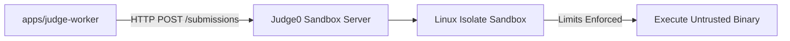

# Sandboxed Untrusted-Code Execution

This document details **Story 3: Sandboxed untrusted-code execution via Judge0 / isolate**.

---

## 1. Isolation Architecture

Untrusted user code is **never executed directly** within the API or worker application containers. Instead, execution is delegated to an isolated Judge0 instance running isolate-based Linux sandboxes.

- **Private Network Execution**: In production, the Judge0 sandbox communicates exclusively through a private container network or local loopback.
- **Fail-Early Validation**: If an unsupported language key is submitted, the system rejects it immediately with an HTTP 400 error rather than assuming an arbitrary default language.

---

## 2. Resource Limit Enforcements

Every submission passes strict execution boundaries configured from `Problem` attributes and system defaults:
- **CPU Time Limit**: Enforces maximum processor time per testcase.
- **Wall Clock Time Limit**: Prevents indefinite blocking on I/O or sleep operations.
- **Memory Limit**: Constrains memory allocation per process to avoid host resource starvation.
- **Process & Thread Limit**: Prevents fork bombs by limiting maximum processes and threads.
- **Output & File Size**: Truncates excessive stdout/stderr output to prevent denial-of-service.
- **Network Isolation**: Outbound network traffic is disabled inside the sandbox to prevent unauthorized network requests or data exfiltration.

---

## 3. Verdict Mapping

Sandbox exit conditions map directly to online judge status codes:
- Normal termination + expected stdout $\longrightarrow$ `ACCEPTED`
- Normal termination + mismatched stdout $\longrightarrow$ `WA`
- Exceeded time limit $\longrightarrow$ `TLE`
- Exceeded memory limit $\longrightarrow$ `MLE`
- Non-zero exit code / signal abort $\longrightarrow$ `RE`
- Compiler failure $\longrightarrow$ `CE`
- Sandbox host unreachable / infrastructure error $\longrightarrow$ `SYSTEM_ERROR`
