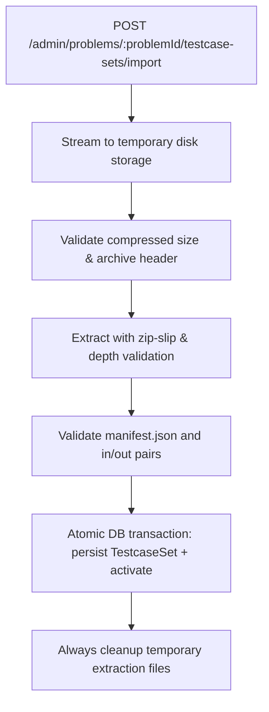

# Testcase Ingestion and Versioning

This document outlines the architecture and technical requirements for **Story 1: Secure, versioned testcase ZIP ingestion**.

---

## 1. Goal & Requirements

Administrators upload a single archive via `POST /admin/problems/:problemId/testcase-sets/import` containing a `manifest.json` file and paired testcase files (`cases/*.in` and `cases/*.out`).

The system ingests the archive safely, validates its structure and payload limits, persists an immutable versioned testcase set, and atomically activates it for the target problem.

---

## 2. Ingestion Pipeline & Security Invariants

### Security Invariants
- **Archive Size & Resource Bounds**: Reject archives exceeding compressed and uncompressed byte limits, excessive entry counts, or suspicious compression ratios (zip bomb detection).
- **Path Traversal Protection (Zip Slip)**: Canonicalize all destination paths and verify that every extracted file stays strictly within the isolated temporary directory boundary. Disallow absolute paths, parent directory traversal (`..`), and symlinks.
- **Manifest & Pair Integrity**: Every input file `cases/{id}.in` must have a corresponding output file `cases/{id}.out` matching the manifest definitions.
- **Guaranteed Cleanup**: Temporary extraction files and directories must be removed unconditionally in `finally` blocks, including when validation or database transactions fail.

---

## 3. Versioning Contract

To ensure reproducible judge results:
1. **`TestcaseSet`**: Each imported batch creates an immutable `TestcaseSet` record containing version number, checksum, and associated testcases.
2. **Atomic Activation**: Switching the active testcase set on a `Problem` is atomic.
3. **Submission Pinning**: When a user creates a `Submission`, it captures `testcaseSetId`. Submissions are always judged against the specific version pinned at submission time, regardless of subsequent administrator updates.

---

## 4. Current Status

In the current baseline codebase, individual testcases are managed via REST endpoints mounted under `apps/api/src/modules/testcases/testcase.route.ts` (`/api/v1/problems/:problemId/testcases`). Full versioned ZIP ingestion with `TestcaseSet` entities will be implemented in Phase 2 & 3.
